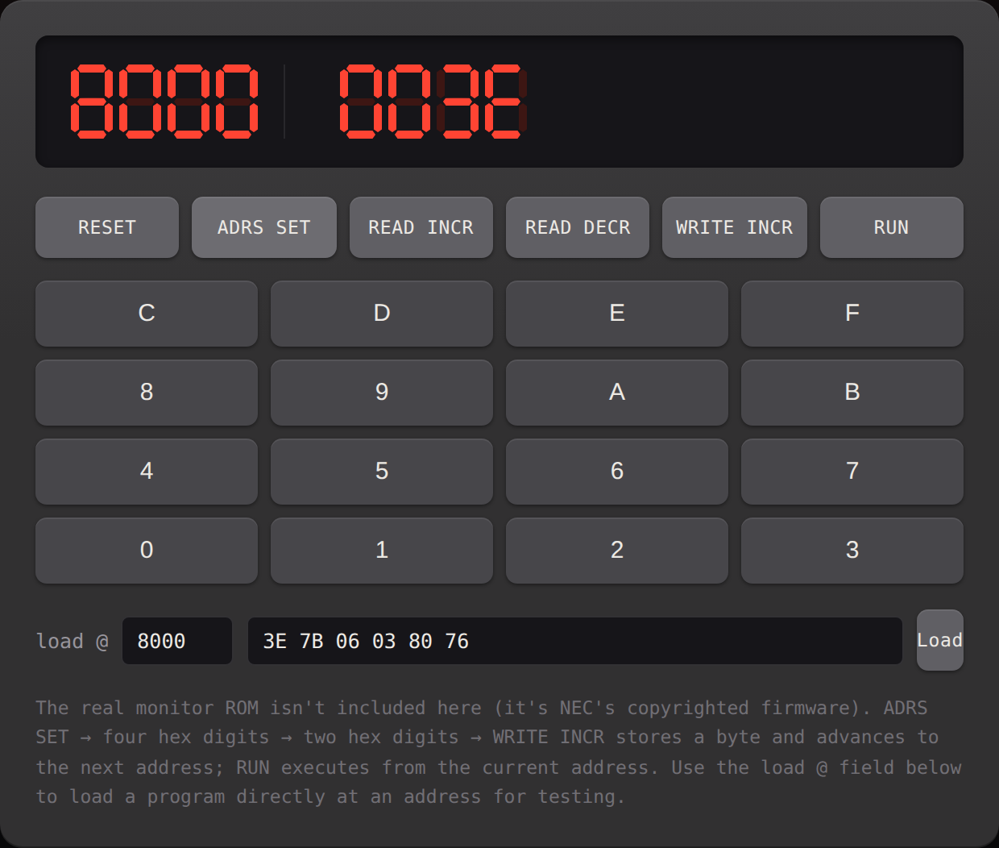

# tk80-emu

[](https://github.com/yonmas/tk80-emu/actions/workflows/ci.yml)
[](https://github.com/yonmas/tk80-emu/actions/workflows/deploy.yml)
[](LICENSE)

ブラウザで動く NEC TK-80 風エミュレーターです。CPUコアは Intel 8080 の全命令をTypeScriptで実装し、その上に TK-80 のフロントパネル操作（アドレス設定・16進キー入力・書き込み・実行）を再現しています。

**公開版: https://yonmas.github.io/tk80-emu/**（ブラウザで直接開けます、インストール不要）



## これは何か / 何でないか

- 実機の **モニターROMは同梱していません**（NECの著作物のため）。かわりにフロントパネルの操作ロジック自体をTypeScriptで実装しており、これが「モニタープログラム」の代わりになっています。
- 表示は実機同様「アドレス4桁＋データレジスタ4桁」の8桁7セグメントLEDです。データレジスタは実機と同じく16ビットのシフトレジスタで、ADRS SET/READ INCR/READ DECR/WRITE INCRのたびに下位バイトが上位2桁へシフトし、新しく読んだ1バイトが下位2桁に入ります（NECのTK-80ユーザーズマニュアル 3.6.3〜3.6.4節の記載どおり）。
- ボタン名・配置は実機のキー配置（上段: `RET` `RUN` `STORE DATA` `LOAD DATA` `RESET`、テンキー右列: `ADRS SET` `READ INCR` `READ DECR` `WRITE INCR`）に合わせています。`STORE DATA` / `LOAD DATA` は実機のカセットテープ・インタフェースの代わりに、ブラウザの localStorage への保存・読込として再実装しています（音声変換は行わず、[アドレス, データ]範囲のメモリをそのまま保存・復元します）。
- CPUは Intel 8080 の全256オペコード（未定義複製含む）を実装済みです。フラグ計算はおおむね正確ですが、減算系命令のACフラグの極性など一部曖昧な仕様は慣例的な実装に倣っています（実機ソフトウェアがそこに依存することはほぼありません）。

## 使い方

```sh
npm install
npm run dev
```

ブラウザで表示されたURLを開くと、TK-80風のパネルが表示されます。

### パネル操作

1. **RESET** でCPU・パネルを初期化
2. 16進キーで4桁のアドレスを入力 → **ADRS SET** でそのアドレスへ移動（同時にそこの1バイトを読み込みます）
3. 16進キーで2桁のデータを入力 → **WRITE INCR** でそのアドレスにバイトを書き込み、次のアドレスへ進みます（連続入力しやすいよう自動で進みます）
4. **READ INCR / READ DECR** で次/前のアドレスへ移動して読み込み
5. **MODE** で AUTO / STEP を切り替え。AUTOなら **RUN** で現在のアドレスから自由実行（`HLT` で自動停止）。STEPなら **RUN** で1命令だけ実行してPC/A/フラグを表示し、続けて **RET** を押すごとに次の1命令ずつ進められます
6. **STORE DATA** で現在の[アドレス, データ]範囲のメモリをブラウザに保存、**LOAD DATA** で読み戻し（実機のカセットテープの代わり）

パネル下の操作説明カードは右上の **ENG/JP** ボタンで英語・日本語を切り替えられます。

### プログラムのロード

実機のようにキー入力だけでプログラムを組むのは大変なので、画面下の「load @」欄でアドレスと16進バイト列（スペース区切り）を指定してメモリへ直接ロードできる開発用の機能を用意しています。

例: アドレス `8000` に `3E 05 06 03 80 76`（`MVI A,05 / MVI B,03 / ADD B / HLT`）をロードして RUN すると、`A = 8` になって停止します。

## 構成

- `src/memory.ts` — 64KBのメモリバス
- `src/cpu8080.ts` — Intel 8080 CPUコア（レジスタ、フラグ、全命令）
- `src/panel.ts` — TK-80フロントパネルの状態機械（アドレスレジスタ/データレジスタ、ADRS SET、READ INCR/DECR、WRITE INCR、RUN/RET、MODE(AUTO/STEP)、RESET、STORE DATA/LOAD DATA）
- `src/main.ts` / `src/style.css` — 7セグメント表示・16進キーパッドのUI

## テスト

```sh
npm test
```

`tests/cpu8080.test.ts` にCPUコアの単体テスト（算術演算・フラグ・分岐・スタック・DAA）、`tests/panel.test.ts` にフロントパネルの単体テスト（NECのユーザーズマニュアルに載っている実例をそのまま再現したもの）があります。

## ライセンス

MIT — [LICENSE](LICENSE) を参照してください。

---

Built with [Claude Code](https://claude.com/claude-code).
